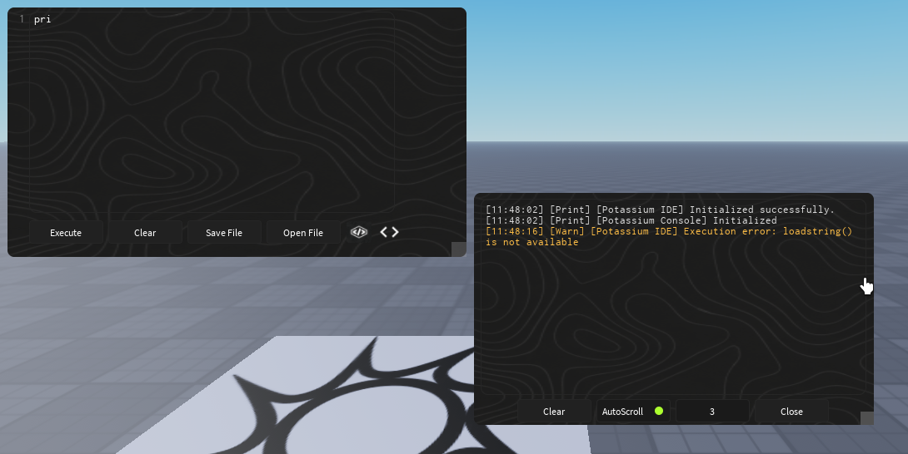

# Potassium IDE

```{=html}
<p align="center">
```
`<b>`A custom Luau code editor / IDE built for
Roblox.`</b>`
```
</p>
```
```
<p align="center">
```
Made by `<b>`}Mana`</b>`
```
</p>
```

------------------------------------------------------------------------

## Preview



> Potassium IDE is designed to provide a more complete code-editing
> experience inside Roblox, including syntax highlighting, autocomplete,
> code folding, bracket tools, error detection, and a custom editor
> cursor.

## Features

### Syntax Highlighting

Potassium renders the editor through a RichText display and highlights
different parts of Luau code, including:

-   Luau keywords
-   Strings
-   Comments
-   Numbers
-   Functions
-   Roblox globals and common Roblox types/services

``` lua
local Players = game:GetService("Players")

local function hello(name)
    print("Hello, " .. name)
end
```

### Autocomplete

Autocomplete provides suggestions while typing common Luau and Roblox
names.

Examples include:

``` text
pri  -> print
war  -> warn
GetS -> GetService
```

The suggestion menu supports keyboard navigation:

-   `Down Arrow` --- next suggestion
-   `Up Arrow` --- previous suggestion
-   `Tab` --- accept suggestion
-   `Enter` --- accept suggestion
-   `Escape` --- close suggestions

### Custom Editor Cursor

Potassium includes its own visible editor caret so the cursor stays
aligned with the syntax-highlighted display.

The cursor:

-   Follows the real `TextBox.CursorPosition`
-   Works with keyboard navigation
-   Works with mouse placement
-   Blinks while editing
-   Tracks the currently rendered line
-   Accounts for folded lines
-   Uses the rendered text width for positioning

### Bracket Auto-Close

Opening characters can automatically create their matching closing
character.

``` text
(  -> ()
[  -> []
{  -> {}
"  -> ""
'  -> ''
```

The cursor is placed between the generated pair so you can continue
typing immediately.

Example:

``` lua
print("|")
```

### Skip Existing Closers

When a closing bracket or quote has already been inserted automatically,
typing that character again can move past the existing closer instead of
creating a duplicate.

This keeps code such as:

``` lua
print("Hello world")
```

from turning into unnecessary duplicate quotes or brackets.

### Bracket Matching

Potassium detects matching bracket pairs for:

``` text
()
[]
{}
```

When the cursor is next to a bracket, the IDE can visually indicate the
corresponding bracket pair.

### Error Detection

The editor performs lightweight code checks while you type.

Current checks include things such as:

-   Unclosed strings
-   Unexpected closing brackets
-   Mismatched brackets
-   Missing closing brackets
-   Unexpected `end`
-   Missing `end`
-   Block structure errors

### Error Underlines

Detected errors can be shown directly inside the editor using visual
error indicators.

This can be enabled or disabled from the feature settings.

### Code Folding

Blocks of code can be collapsed from the gutter to make larger scripts
easier to navigate.

Supported block styles include:

``` lua
if condition then
end

for i = 1, 10 do
end

while condition do
end

function example()
end

local function example()
end

do
end

repeat
until condition
```

Foldable lines receive a gutter indicator that can be clicked to
collapse or expand the block.

### Line Numbers

The editor includes a gutter with line numbers that stay synchronized
with the code display.

The gutter also integrates with code folding.

### Smart Enter

Smart Enter can automatically create indentation and closing blocks when
starting supported Luau structures.

For example:

``` lua
if condition then
    |
end
```

Smart Enter is configurable and can be enabled from the settings menu.

### Resizable Editor

The IDE window can be resized while keeping the editor layout
synchronized.

The current implementation constrains the editor between configured
minimum and maximum dimensions and updates the gutter, errors, bracket
matching, and autocomplete placement when resized.

### Scrolling

The editor supports vertical scrolling for larger scripts and
dynamically adjusts its canvas height based on the number of lines.

### Settings Menu

Editor features can be individually enabled or disabled.

Current feature toggles:

  Feature              Default
  -------------------- ---------
  Smart Enter          Off
  Bracket Matching     On
  Error Underlines     On
  Code Folding         On
  Autocomplete         On
  Bracket Auto-Close   On

The settings interface also uses animated transitions when opening,
closing, and changing toggle states.

### Execute

The IDE includes an Execute button for running the current editor
contents in environments where `loadstring` is available.

Execution is wrapped in `pcall` so errors can be caught and reported
instead of immediately breaking the IDE.

### Console

Potassium can open its accompanying console UI from the editor.

This gives the IDE a dedicated place for runtime/output-related
information when the console component is supplied.

### Clear Editor

The Clear button instantly removes the current editor contents.

## Editor Architecture

Potassium separates input from rendering:

``` text
EditorContent
├── Gutter
├── HighlightBar
├── Display
├── Input
└── EditorCursor
```

-   **Input** is the real Roblox `TextBox` responsible for typing and
    cursor state.
-   **Display** renders the syntax-highlighted RichText representation.
-   **EditorCursor** renders the custom visible caret.
-   **Gutter** provides line numbers and folding controls.
-   **HighlightBar** is available for editor line highlighting.

Keeping the input and display aligned allows Potassium to provide custom
rendering without losing normal text-editing behavior.

## Built With

-   Roblox Studio
-   Luau
-   Roblox UI objects
-   `UserInputService`
-   `TweenService`
-   `RunService`
-   `TextService`

## Status

Potassium IDE is actively being developed. Features and behavior may
change as the editor is improved.

## Author

**Mana**

Creator and developer of **Potassium IDE**.

------------------------------------------------------------------------

```
<p align="center">
```
`<b>`Potassium IDE`</b>``<br>` A custom Luau
editing experience for Roblox.
```
</p>
```
